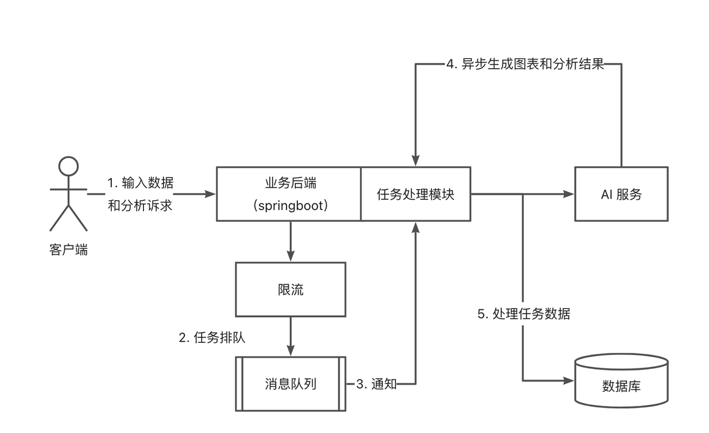

# LiBi-智能 BI 项目

## 一、项目概述

在传统的数据分析平台中，如果我们想要分析近一年网站的用户增长趋势，通常需要手动导入数据、选择要分析的字段和图表，并由专业的数据分析师完成分析，最后得出结论。然而，本次设计的项目与传统平台有所不同。在这个项目中，用户只需输入想要分析的目标，并上传原始数据，系统将利用
AI 自动生成可视化图表和学习的分析结论。这样，即使是对数据分析一窍不通的人也能轻松使用该系统。

## 二、项目介绍

BI 即商业智能(数据可视化、报表可视化系统)

**主流 BI 平台**：帆软 BI、小马 BI、微软 Power BI

**传统 BI 平台需要按照以下步骤** [查看传统 BI 平台示例](https://chartcube.alipay.com/)：

1. 手动上传数据

2. 手动选择分析所需的数据行和列（由数据分析师完成）

3. 需要手动选择所需的图表类型（由数据分析师完成）

4. 生成图表并保存配置

**本次项目所设想的智能 BI 平台**

与传统的 BI 不同，我们的解决方案允许用户（数据分析者）仅需导入最最最原始的数据集并输入分析目标（例如网站增长趋势），即可利用
AI 自动生成符合要求的图表和结论，从而显著提升分析效率。

**优点**：即使没有数据分析经验的同学也能通过简单的输入目标快速完成数据分析，从而大幅减少人力成本。我们利用 AI 接口来实现这一功能。

## 三、项目架构图

